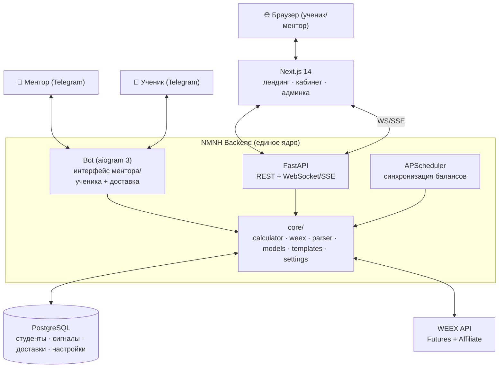
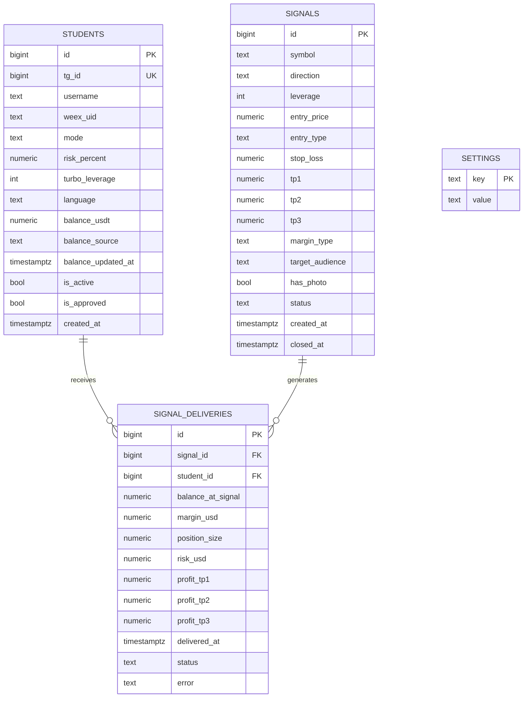
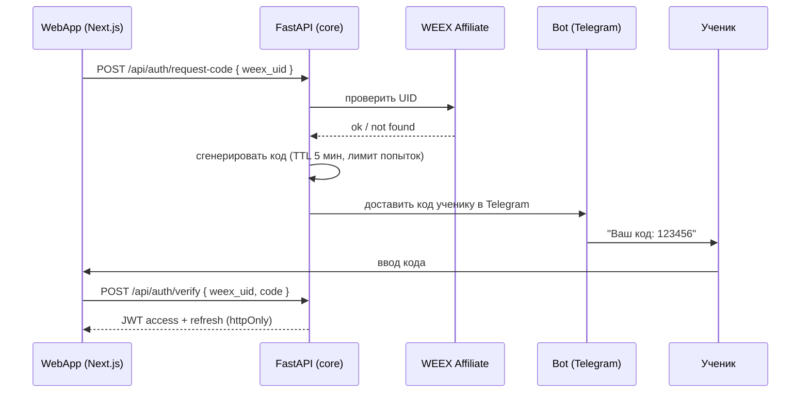

# NMNH — Единая архитектура (Unified Core)

> Документ описывает **общее ядро** для двух продуктов NMNH — Signal Bot и WebApp. Создан в рамках
> доработки ТЗ (см. [AUDIT.md → A‑03](../audit/AUDIT.md#a-03-дублирование-ядра-калькулятор-weex-модель-данных)),
> чтобы устранить дублирование бизнес‑логики и противоречия между документами.

## Зачем единое ядро

Исходно бот и веб‑платформа проектировались как два независимых проекта со своими копиями
калькулятора, WEEX‑клиента, парсера сигнала и модели данных (бот — на SQLite, веб — на PostgreSQL).
Это два источника истины для одной бизнес‑логики → расчёты расходятся, поддержка дублируется.

**Принцип:** один бэкенд (**FastAPI + PostgreSQL**) и один Python‑пакет **`core`**, который владеет:
- калькулятором позиции (умеренный/турбо),
- WEEX‑клиентом (Futures + Affiliate),
- парсером сигнала,
- моделью данных и доступом к БД (SQLAlchemy),
- шаблонами сообщений (RU/EN) и настройками (`settings`).

Бот и веб‑платформа — **клиенты** этого ядра.

## Компонентная диаграмма



Ключевое: и `Bot`, и `API`, и `Sched` используют один и тот же `core` и одну `PostgreSQL`. WEEX и БД
доступны только через `core` (единая точка подписи запросов, кэширования цен, доступа к данным).

## Модель данных

Единая схема для бота и веб‑платформы (детали полей — в ТЗ:
[бот §4](../tz/signal-bot-tz.md#4-база-данных-postgresql), [веб](../tz/webapp-tz.md)). Денежные
значения — `NUMERIC` ([A‑09](../audit/AUDIT.md#a-09-точность-денежных-вычислений)), время — `TIMESTAMPTZ`
в UTC ([A‑07](../audit/AUDIT.md#a-07-часовые-пояса)).



Уникальный индекс `signal_deliveries (signal_id, student_id)` обеспечивает идемпотентность доставки
([A‑06](../audit/AUDIT.md#a-06-идемпотентность-и-ретраи-доставки)). Веб‑сущности (чат, аватары,
JWT‑refresh, changelog) добавляются как отдельные таблицы поверх этой базовой схемы.

## Калькулятор

Единственная реализация в `core/calculator` (Python, `Decimal`). И бот, и веб‑эндпоинт
`/api/market/calculate`, и клиентский калькулятор используют **одни формулы и параметры из `settings`**
([A‑05](../audit/AUDIT.md#a-05-дублирование-настроек-и-шаблонов)).

```
# Маржа (канон — записанные формулы, A‑11)
moderate: margin = balance ** 0.55 * 1.8
turbo:    margin = min(balance ** 0.6 * 1.2, settings.turbo_margin_cap)

position_size = margin * leverage

# Стоп: умеренный — фиксированный %, турбо — адаптивный к плечу (A‑11)
moderate: sl_percent = settings.moderate_sl_percent
turbo:    sl_percent = min(settings.turbo_sl_percent,
                           settings.turbo_sl_buffer * 100 / leverage)

risk_usd   = position_size * sl_percent / 100
profit_tpN = position_size * tpN_percent / 100
```

**Решения A‑11** (см. [AUDIT.md → A‑11](../audit/AUDIT.md#a-11-формулы-маржи-несоответствие-и-стоп-за-ликвидацией)):
- Канон сайзинга — формулы (консервативные); противоречивые таблицы‑примеры приведены в соответствие.
- **Адаптивный турбо‑стоп:** `sl% = min(turbo_sl, turbo_sl_buffer·100/плечо)` — стоп всегда до ликвидации.
- **Guardrails:** проверка минимального ордера WEEX (`skipped`), границы маржи, кап турбо.

## Контракты между компонентами

### Контракт auth‑flow (UID → код)
Логин в веб‑платформу использует бота как канал доставки кода
([A‑10](../audit/AUDIT.md#a-10-контракт-веб--бот-auth-flow)):



Граничные случаи: у пользователя нет открытого диалога с ботом → сообщение «откройте @nmnh_bot и
нажмите /start»; превышен лимит попыток → блокировка по rate limit
([A‑08](../audit/AUDIT.md#a-08-безопасность-и-секреты)).

### Контракт доставки сигнала
Ментор создаёт сигнал (через бот `/signal` или веб `/admin/signal/new`) → `core` парсит, считает под
каждого ученика, пишет `signal_deliveries`, доставляет **от обычного бота**
([A‑02](../audit/AUDIT.md#a-02-userbot-pyrogram--риск-блокировки-личного-аккаунта)) с задержкой 3–5 c,
идемпотентно. Веб получает событие `new_signal` через WebSocket.

### Контракт синхронизации балансов
APScheduler внутри бэкенда каждые `settings.balance_sync_interval` минут обновляет балансы через
аффилиат‑API ([A‑01](../audit/AUDIT.md#a-01-weex-affiliate-api--баланс-реферала-по-uid)); при сбое —
fallback `balance_source = manual` и уведомление ментору; событие `balance_update` → веб.

### Сборщик цен (A‑12)
Один **серверный сборщик** цен в бэкенде следит только за символами активных сигналов, опрашивает/
слушает WEEX с троттлингом и раздаёт обновления клиентам через собственный WebSocket (`price_update`)
и SSE (публичные цены на лендинге). Клиенты **не** ходят на биржу напрямую — это исключает упор в лимиты
WEEX и лишние соединения. См. [AUDIT.md → A‑12](../audit/AUDIT.md#a-12-источник-и-частота-price_update).

### Источник PnL — гибрид (A‑14)
PnL и история сделок ученика формируются **гибридно**: реальные данные из WEEX (где аффилиат‑API
отдаёт сделки/позиции реферала), иначе — **модельный** PnL по сигналам (TP/SL) с явной пометкой
`pnl_source = real | model`. Веб и бот показывают источник, чтобы цифры не вводили в заблуждение.
См. [AUDIT.md → A‑14](../audit/AUDIT.md#a-14-источник-pnl-и-истории-сделок).

### Локализация (A‑15)
Единый словарь локализации интерфейса и общий формат шаблонов сообщений (RU/EN) живут в `core`
(`templates/`, `i18n/`). Язык — из `students.language`. Бот и веб переводят согласованно, без
дублирования словарей.

## Структура монорепозитория

Единый репозиторий, общий пакет `core` переиспользуется ботом и бэкендом веб‑платформы.

```
nmnh/
├── core/                       # ← единое ядро (Python-пакет)
│   ├── calculator/             # умеренный/турбо, адаптивный стоп, Decimal (A‑11)
│   ├── weex/                   # client (HMAC), market, affiliate
│   ├── parser/                 # парсинг сигнала
│   ├── models/                 # SQLAlchemy модели (общая схема)
│   ├── templates/              # signal_ru / signal_en
│   ├── i18n/                   # единый словарь локализации (A‑15)
│   ├── settings/               # доступ к таблице settings
│   └── db.py                   # подключение PostgreSQL
│
├── backend/                    # FastAPI (REST + WS/SSE) — использует core
│   ├── api/                    # auth, signals, students, analytics, chat, system, market
│   ├── ws/                     # WebSocket/SSE
│   ├── price_collector/        # серверный сборщик цен + фан‑аут (A‑12)
│   └── scheduler/              # APScheduler (balance sync)
│
├── bot/                        # aiogram 3 + доставка — использует core
│   ├── mentor/ · student/      # хендлеры
│   └── delivery/               # доставка от обычного бота (aiogram)
│
├── webapp/                     # Next.js 14 (см. webapp ТЗ §16)
│
├── docs/                       # ТЗ, аудит, архитектура (этот каталог)
└── deploy/                     # Render, CI/CD, .env.example
```

> Альтернатива монорепо — отдельные репозитории с `core` как устанавливаемым пакетом. Монорепо
> предпочтительнее на старте: проще держать единый источник истины и согласованные миграции БД.

## Поэтапный roadmap и сроки

Стратегия: построить ядро вместе с **Фазой 1 (бот)**, затем переиспользовать его в **Фазе 2 (веб)**.

### Фаза 0 — Фундамент (≈2–3 дня)
Монорепо, PostgreSQL‑схема и миграции, `core` каркас (db, settings, WEEX‑клиент с подписью),
`.env`/секреты, CI заготовка.

### Фаза 1 — Signal Bot MVP (≈10–12 дней, как в ТЗ бота)
Калькулятор (умеренный/турбо), парсер, аффилиат‑баланс, aiogram (ментор+ученик), доставка
(обычный бот), APScheduler, шаблоны RU/EN, тесты, деплой. **Результат:** рабочий продукт + готовое
ядро. Здесь же валидируется WEEX‑интеграция и формулы на реальных балансах.

### Фаза 2 — WebApp (полный объём, ≈50–60 дней)
Поверх готового ядра: FastAPI‑эндпоинты (часть логики уже в `core`), WebSocket/SSE + сборщик цен,
авторизация (контракт auth‑flow), кабинет, панель ментора, лендинг (GSAP/Three.js), мультичарт,
полная аналитика, PWA/SEO, Storybook, тесты, документация. Реализуется **полный объём ТЗ v2.1**
([A‑13](../audit/AUDIT.md#a-13-объём-вебаппа-для-mvp) — решено: без урезания). Переиспользование
калькулятора/WEEX/парсера/моделей из Фазы 1 экономит часть бэкенд‑объёма.

| Фаза | Содержание | Оценка |
|---|---|---|
| 0 | Фундамент (монорепо, БД, core‑каркас) | 2–3 дня |
| 1 | Signal Bot MVP + ядро | 10–12 дней |
| 2 | WebApp (полный объём) поверх ядра | 50–60 дней |
| **Итого** | — | **~62–75 дней** |

Все вопросы аудита закрыты: доставка — **обычный бот** (A‑02), объём веба — **полный** (A‑13),
сайзинг маржи — **формулы‑канон** + адаптивный стоп (A‑11), PnL — **гибрид** (A‑14), цены — серверный
сборщик (A‑12). Открытых блокеров нет.

## Связанные документы
- [Аудит ТЗ — AUDIT.md](../audit/AUDIT.md)
- [ТЗ Signal Bot (доработанное)](../tz/signal-bot-tz.md)
- [ТЗ WebApp (доработанное)](../tz/webapp-tz.md)
