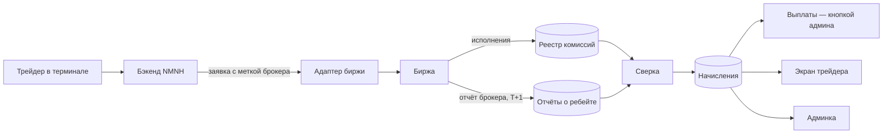

# Брокерская программа NMNH — план

> Состояние на 2026-09-10. Код не менялся: сначала сбор данных и заявки биржам (этап 0),
> потом реализация по этапам. Связано: [карта WEEX API](weex-affiliate-api.md),
> [партнёрка в админке](../../backend/api/admin_affiliate.py).

## 1. Цель и модель

NMNH.TRADE работает как брокер бирж, а не как партнёрская ссылка:

```
трейдер платит бирже комиссию
  → биржа отдаёт NMNH часть комиссии (ребейт брокера) за заявки с меткой NMNH
    → NMNH возвращает трейдеру часть ребейта (кэшбэк)
      → разница остаётся NMNH
```

Трейдер торгует в интерфейсе NMNH (график, стакан, кластеры, позиции, риск, журнал).
Биржа держит баланс, маржу, исполнение, ликвидации, депозиты и выводы. Деньги трейдеров
NMNH не держит никогда.

Посредник вроде Tiger не нужен: NMNH сам подаёт заявки на брокерство и сам ставит свою метку
в каждую заявку. В коде Tiger упоминается только в комментарии о ширине колонок
([DomTrader.tsx:32](../../webapp/components/scalping/DomTrader.tsx)) - убирать нечего.

### Решение от 10 сентября 2026: начинаем с партнёрской модели

Переписка с биржами показала, что схема выше упирается в чужие правила, и на разных биржах
по-разному (подробности - в [заявках](broker-applications.md), §6-7). Поэтому путей к деньгам
теперь два, и первым идёт не тот, что описан выше.

**Партнёрская модель - то, что делаем сейчас.**

```
трейдер регистрируется на бирже по ссылке академии
  -> торгует в терминале NMNH своим ключом
    -> биржа платит NMNH партнёрскую комиссию с его сделок
      -> часть комиссии возвращается трейдеру кэшбэком, разница остаётся NMNH
```

Брокерский статус для этого не нужен, разрешения биржи тоже: партнёрка у нас уже есть на
WEEX и BingX, API открыт всем. Работает с первого дня.

Цена этой простоты - регистрация нового счёта. Трейдера, у которого счёт уже есть, схема не
охватывает: он нам не реферал, и его оборот не засчитывается никак.

Кэшбэк здесь не украшение, а ответ на главное возражение. «Заведи ещё один счёт» само по
себе - трение, ради которого никто не станет шевелиться. «Заведи счёт и плати меньше
комиссии, а сверху получи терминал» - уже обмен, в котором понятно, что человек получает.

**Брокерская модель - надстройка, когда дорастём.** Она нужна ровно за тем, чего не умеет
партнёрская: забирать оборот трейдеров, которые пришли не по нашей ссылке. Заявки поданы,
ответы собираем, но блокировать ими запуск нельзя.

### Что проверить до того, как обещать кэшбэк

1. **Разрешает ли биржа делиться комиссией.** Не все: Binance на фьючерсах запрещает прямо.
   Обещание, которое придётся отзывать, обойдётся дороже несделанного.
2. **Кто считает и платит.** Если долю реферала можно задать в партнёрском кабинете, скидка
   идёт автоматически и разработки не требует вовсе. Если нет - нужен реестр начислений,
   выплаты и разбор споров «мне недоплатили», то есть всё, что описано в §2 и §4.3.
3. **Размер.** 25% - ниже рынка: кэшбэк-сервисы дают 20-45%, Tiger на Binance 35%. Наш
   ответ - не проценты, а связка «скидка плюс рабочее место», где сравнивают уже не с
   кэшбэком, а с кэшбэком и продуктом.
4. **Плавающая ставка биржи.** Партнёрские ставки пересматриваются (у Binance - ежеквартально
   по результатам). Фиксированная доля трейдера при снижении ставки съедает маржу целиком -
   поэтому доля ограничена сверху, см. формулы в §2.

### Что уже есть

- Торговля идёт через сервер: ключи трейдера зашифрованы в `weex_credentials`, заявки ставит
  бэкенд ([futures.py](../../core/weex/futures.py), [trading.py](../../backend/api/trading.py),
  [trading_move.py](../../backend/api/trading_move.py), [watcher.py](../../backend/trading/watcher.py)).
  Значит, метку брокера можно ставить в каждую заявку, и трейдер не сможет её обойти.
- NMNH уже партнёр WEEX, партнёрский API подключён (рефералы, обороты, комиссии, балансы).
- Исполнения с комиссией уже запрашиваются при закрытии сделки (`_settled` в `trading.py`),
  фактическая ставка трейдера выводится из его сделок (`taker_fee` в `trading.py`).

### Чего нет

- Биржа только одна (WEEX), общего слоя бирж нет.
- Комиссия хранится одной суммой на сделку (`ScalpTrade.fee`, float), реестра исполнений нет.
- Нет брокерской метки, отчётов о ребейте, начислений, выплат и экранов программы.

## 2. Экономика

### Формулы (на каждого трейдера, биржу, продукт и день)

```
комиссия     = Σ комиссий исполнений с меткой NMNH
ребейт       = из отчёта биржи (факт); до отчёта — комиссия × договорная ставка (оценка)
кэшбэк       = комиссия × доля трейдера
               но не больше (ребейт − комиссия × минимальная маржа NMNH)
доход NMNH   = ребейт − кэшбэк
ставка трейдера = ставка биржи × (1 − доля трейдера)
экономия, %  = доля трейдера (плюс скидка биржи, если она выторгована, см. §3)
```

Долю трейдера задаём **от его комиссии**, а не от ребейта: так ему понятно («комиссия ниже на 25%»),
и так же делает Tiger. Ограничение сверху не даёт NMNH уйти в минус, если биржа понизит уровень.

### Пример на ставке WEEX (0.08% тейкер)

Ставка 50% - уровень Bronze по правилам WEEX для своих рефералов и трейдеров без
пригласившего. С чужих рефералов WEEX платит 8%, и кэшбэк там почти невозможен (см.
[заявки](broker-applications.md), §10).

| | На трейдера в месяц |
|---|---|
| Оборот | $1 000 000 |
| Комиссия трейдера | $800 |
| Ребейт NMNH (50%) | $400 |
| Кэшбэк трейдеру (30% от комиссии) | $240 |
| Доход NMNH | $160 |
| Ставка трейдера | 0.08% → 0.056% |

Для масштаба: 1000 трейдеров × $300 комиссии = $300 000; при ребейте 40% и кэшбэке 25%
трейдерам уходит $75 000, у NMNH остаётся $45 000 в месяц.

### Правила распределения

1. Ставки хранятся **версиями** с датой начала. Прошлые дни пересчитываются по той версии,
   что действовала в тот день; запись не правится задним числом.
2. Уровни трейдера — по его обороту за 30 дней (как VIP у биржи), плюс персональная ставка
   для отдельных трейдеров.
3. Флаг «кэшбэк разрешён» на каждой бирже. У Binance он выключен (см. §3): там весь ребейт — доход
   NMNH, а выгода трейдеру, если она будет, — не деньгами.
4. Выплачивается только **подтверждённое** биржей. Оценку показываем отдельно и так и подписываем.
5. Суммы в реестре и начислениях — `Decimal`/`Numeric`, не float. Выплаты округляются вниз до
   0.01 USDT, остаток переносится на следующий день.

## 3. Биржи: что выяснено

### Главное, что меняет план

- **Binance запрещает партнёрам возвращать комиссию пользователям** и за нарушение урезает ставку.
  Ребейт идёт только с **новых** пользователей: зарегистрированных после того, как NMNH стал
  партнёром, без чужого реф-кода, с VIP ниже 3. С 2025-10-01 базовые 20% / 10% отменены: не держишь
  уровень Bronze по итогам квартала — исключение из программы.
- **У Tiger два механизма, а не один.** На Bybit биржа по договору сразу даёт их трейдерам
  сниженную ставку (фьючерсы 0.035% тейкер / 0.014% мейкер) и сверху 10% возврата; на Binance —
  «до 35%». Возврат приходит на спот-кошелёк трейдера каждый день за прошлые сутки. Скидку «на
  входе» даёт биржа — это отдельный пункт переговоров.
- **Проценты с сайтов — потолки.** Реальная ставка индивидуальна и пересматривается. У Bybit
  особые условия получают только верхние 5–10% брокеров.

### Централизованные биржи

| Биржа | Как метится заявка | Публично «до» | Кого засчитывают, тонкости | Статус |
|---|---|---|---|---|
| **WEEX** | `newClientOrderId` начинается с `b-WEEX123456-`, ≤ 64 символов (спот и фьючерсы) | Bronze/Silver/Gold: 50/60/70% со своих и трейдеров без пригласившего, 8/11/15% с чужих рефералов | Нужно участие в партнёрке - у NMNH есть. Суб-аффилиаты и их приглашённые брокерской комиссии не дают. На старте нет требований к обороту. API: CheckUserEligibility, GetBrokerCommissionRecords, GetBrokerRebateRatio | документация получена 11.09.2026 |
| **Bybit** | заголовок `X-Referer` в `/v5/order/create` | до 45% | Уровни по объёму и новым пользователям. Пользователь под аффилиатом — потолок 45%. Есть Broker Dashboard | не подана |
| **OKX** | параметр `tag` = broker code | до 50% | Засчитывает и старых, и новых. Нет ребейта с VIP7+, VIP5–6 с исчерпанным потолком, MSA. Отчёты: `/api/v5/broker/fd/rebate-per-orders`, проверка: `/api/v5/broker/fd/if-rebate` | не подана |
| **Binance** | `newClientOrderId` начинается с `x-{LinkID}`, < 36 символов (`/api/v3/order`, `/fapi/v1/order`) | 30–50% | Только новые, без реф-кода, VIP < 3 (поля `rebateWorking`, `ifNewUser`). **Кэшбэк запрещён.** Уровень Bronze ежеквартально. Ребейт — на спот- и фьючерсный кошельки | не подана |
| **Bitget** | код канала брокера в заявке (точное поле — уточнить) | 25–50% | Фьючерсы: ≥100k USDT → 30%, ≥5M → 35%, ≥20M → 40%, ≥100M → 45%, ≥300M → 50%. Идёт параллельно с реферальной. Выплата за день T — на T+1 | не подана |
| **Gate** | идентификатор канала `x-gate-channel-id` | фьючерсы до 60% | Ставка — от объёма и новых пользователей. История брокера — окнами ≤ 30 дней | не подана |
| **KuCoin** | заголовки `KC-API-PARTNER`, `KC-API-PARTNER-SIGN`, `KC-BROKER-NAME`, `KC-API-PARTNER-VERIFY` на каждом REST-запросе | 40–55%, до 70% с приглашёнными | Есть выгрузка ребейт-ордеров | не подана |
| **BingX** | заголовок `X-SOURCE-KEY` | до 55% | Начисление ежедневно | не подана |
| **HTX** | Broker ID от их команды | спот 40–50%, фьючерсы 50–60% | Со старых аккаунтов — 10% | не подана |
| **MEXC** | Broker ID + ключ пользователя (поле — уточнить) | до 60% (на запуске программы) | Контакт institution@mexc.com | не подана |
| **BitMart** | Broker ID + ключ пользователя | 60%+ | Нужен KYC организации | не подана |
| **CoinEx** | `broker_id` внутри `client_id` | от 40% | Первые 3 месяца без условий | не подана |
| **BloFin** | Brokerage ID | индивидуально | Начисление ежечасно | не подана |

### Децентрализованные биржи — другая модель

| Биржа | Механика | Тонкости |
|---|---|---|
| **Hyperliquid** | builder code в каждой заявке: `{"b": адрес, "f": ставка}` | NMNH сам добавляет комиссию: ≤ 0.1% на перпах, ≤ 1% на споте. Трейдер один раз подписывает `ApproveBuilderFee` основным кошельком. У NMNH ≥ 100 USDC на счёте |
| **Aster** | Aster Code: агент-кошелёк + ставка, одобряется пользователем | Депозит 100 ASTER, сбор ежедневно |
| **dYdX** | builder code: адрес выплаты + ставка в ppm в заявке | Начисляется протоколом при исполнении |

Ребейта здесь нет: «кэшбэк» — просто меньшая наценка NMNH. Нужен кошелёк трейдера вместо
API-ключей — коннектор другого типа. Поэтому эти биржи идут последним этапом.

## 4. Архитектура



### 4.1 Слой бирж

`core/exchanges/` с общим интерфейсом (Protocol) и адаптером на каждую биржу:

- заявки: поставить, условная защита, передвинуть, снять, открытые;
- позиции, исполнения (с комиссией и признаком maker/taker), фильтры инструмента и ставки;
- брокер: `tag(order_id)`, `untag(raw)`, отчёт о ребейте за день, проверка пользователя.

Первый адаптер — обёртка над нынешним `core/weex/futures.py` без изменения поведения, под теми же
тестами. Потом `trading.py`, `trading_move.py` и `watcher.py` переводятся с `FuturesClient` на
адаптер. Это самая большая часть работы.

### 4.2 Брокерская метка

- Ставится **в одном месте — в адаптере**, не в вызовах. При чтении ответов биржи адаптер её
  снимает: сопровождение узнаёт свои заявки по меткам `tp<N>_…`, `sl<N>_…` и идентификатору
  сделки ([watcher.py:1359](../../backend/trading/watcher.py)), и префикс не должен их сломать.
- **Длина.** WEEX ≤ 64 символов вместе с `b-WEEX123456-`, Binance < 36 вместе с `x-{LinkID}`.
  Сейчас идентификатор приходит со страницы (`body.client_order_id`), при переносе дописывается
  `-{replaces}` ([trading_move.py:297](../../backend/api/trading_move.py)). План: короткий
  биржевой идентификатор на каждую заявку (base36 от id сделки + номер переноса) и соответствие
  «биржевой id → сделка» в базе.
- **Условные заявки** (стопы и цели) уходят с `clientAlgoId` (≤ 32 символов). WEEX описывает
  метку только для `newClientOrderId`. Если выходы не засчитываются, теряется до половины
  оборота — вопрос №1 к WEEX (§8).
- Включается переменной на биржу (`WEEX_BROKER_ID=…`); пусто — метки нет. Так выкатываем
  без риска и откатываем одной переменной.

### 4.3 Модель данных

Все таблицы новые; денежные поля — `Numeric`. Миграция — через `_migrate_add_columns` /
`create_all` в [core/db.py](../../core/db.py), как сейчас.

| Таблица | Поля | Назначение |
|---|---|---|
| `exchange_accounts` | student_id, exchange, exchange_uid, api_key_enc, secret_enc, passphrase_enc, key_tail, is_active, rebate_eligible, eligibility_reason, checked_at; unique (student_id, exchange) | Ключи по биржам. Переносит `weex_credentials` со значением `exchange='weex'`; старая таблица живёт до конца этапа 2 |
| `broker_programs` | exchange, product, broker_id, status, rebate_rate, cashback_allowed, trader_share, nmnh_min_margin, valid_from, note | Условия программы, **версиями**: изменение — новая строка |
| `cashback_tiers` | exchange, product, min_volume_30d, trader_share, valid_from | Уровни трейдера по обороту |
| `fee_overrides` | student_id, exchange, trader_share, valid_from, note | Персональная ставка |
| `fee_fills` | student_id, exchange, product, symbol, order_id, fill_id, exchange_order_id, side, qty, price, notional_usdt, fee_usdt, fee_coin, liquidity, tagged, filled_at; unique (exchange, fill_id) | Реестр исполнений. `tagged=false` — заявка не через NMNH, в программу не входит |
| `rebate_reports` | exchange, product, exchange_uid, student_id (null — не опознан), day, fee_usdt, rebate_usdt, rate, raw_json, imported_at; unique (exchange, exchange_uid, product, day) | Отчёты бирж, приведённые к «день × пользователь × продукт»; сырой ответ сохраняется |
| `cashback_accruals` | student_id, exchange, product, day, volume_usdt, fee_usdt, rebate_usdt, trader_share, cashback_usdt, nmnh_usdt, status, program_id, payout_id; unique (student_id, exchange, product, day) | Начисления: `estimated → confirmed → paid`, плюс `void` |
| `cashback_payouts` | student_id, exchange, amount_usdt, method, status, external_ref, approved_by, created_at, paid_at | Выплаты: перевод на UID на бирже / монеты NMNH / скидка в академии |

«День» — в часовом поясе отчёта конкретной биржи (у WEEX сутки считаются по UTC+8, как уже
учтено в `_period` в `admin_affiliate.py`).

### 4.4 Фоновые задачи

По образцу существующих задач в `backend/main.py` / `backend/balance_collector.py`:

1. **Реестр исполнений.** На этапе 1 исполнения пишутся там, где они уже запрашиваются, — при
   закрытии сделки (`_settled`). Плюс ночная дозагрузка по инструментам, которыми торговали.
2. **Импорт отчётов.** Раз в сутки, после времени публикации отчёта биржей. Повторный импорт
   того же дня ничего не дублирует (unique-ключ), потерянные страницы догружаются — у WEEX это
   уже случалось с `getAffiliateCommission`.
3. **Сверка и начисления.** Сравнение нашей комиссии с комиссией из отчёта по трейдеру и дню.
   Расхождение больше порога — в список админки. Начисления пересчитываются идемпотентно.
4. **Проверка допуска.** При подключении ключа и раз в сутки: приносит ли аккаунт ребейт
   (WEEX CheckUserEligibility, OKX `if-rebate`, Binance `rebateWorking`/`ifNewUser`).

### 4.5 API

Трейдер (`get_current_student`):

- `GET /api/fees/summary?period=month` — по каждой бирже: ставка биржи, ставка трейдера,
  экономия %, оборот, комиссия, кэшбэк (ожидается / подтверждён / выплачен), допуск и его причина;
- `GET /api/fees/history?days=30` — по дням.

Админ (`get_current_mentor`):

- `GET /api/admin/fees/overview?days=` — оборот, валовые комиссии, ребейт бирж, кэшбэк
  трейдерам, доход NMNH; разбивка по биржам;
- `GET /api/admin/fees/traders`, `GET /api/admin/fees/reconciliation`;
- `GET/POST /api/admin/fees/programs` — просмотр и новая версия условий (проверка:
  доля трейдера ≤ ставка ребейта − минимальная маржа);
- `GET /api/admin/fees/payouts`, `POST /api/admin/fees/payouts/{id}/approve`.

### 4.6 Интерфейс

- **Трейдер:** блок «NMNH FEE PROGRAM» в профиле (`webapp/app/app/profile`) — ставка биржи,
  ваша ставка, экономия, кэшбэк за месяц по статусам; в терминале (`webapp/app/app/scalping`) —
  фактическая ставка рядом с нынешней оценкой комиссии. Если аккаунт не приносит ребейт —
  прямо сказать почему (чужой реф-код, VIP, старый аккаунт на Binance).
- **Админ:** страница `webapp/app/admin/fees` — пять показателей (объём, комиссии, ребейт,
  кэшбэк, доход NMNH), таблицы по биржам, трейдерам и дням, расхождения сверки, условия
  программ с историей версий, очередь выплат с кнопкой подтверждения.

## 5. Этапы

Размер: S — дни, M — до двух недель, L — больше.

### Этап 0 — данные и заявки (сейчас, без кода)

| # | Задача | Кто |
|---|---|---|
| 0.1 | Юрлицо, юрисдикция, документы для KYB; сайт и описание продукта | заказчик |
| 0.2 | Цифры для заявок: оборот в месяц, активные трейдеры, новые регистрации (есть в админке партнёрки) | заказчик / выгрузка из админки |
| 0.3 | Нынешние условия партнёрки WEEX (поле `rate` уже приходит в отчёте комиссий) | выгрузка |
| 0.4 | Заявка WEEX Broker | заказчик |
| 0.5 | Заявки OKX, Bybit, Bitget, Gate, BingX, KuCoin, MEXC, HTX, BitMart, CoinEx, BloFin | заказчик |
| 0.6 | Binance Link — только с письменным вопросом о кэшбэке | заказчик |
| 0.7 | Ответы бирж на вопросы §8 — в таблицу §3 | заказчик → разработка |
| 0.8 | Юрист: выплаты кэшбэка и правила программы для трейдеров | заказчик |

Готово, когда: есть договор хотя бы с WEEX, ставка и ответы на вопросы §8 для WEEX.

### Этап 1 — вся механика на WEEX (L)

1. Брокерская метка в `place_order` (+ снятие при чтении), короткий биржевой идентификатор,
   переменная `WEEX_BROKER_ID`. Тесты: длина ≤ 64, обратимость, сопровождение узнаёт свои заявки.
2. Таблицы `broker_programs`, `cashback_tiers`, `fee_overrides`, `fee_fills`,
   `rebate_reports`, `cashback_accruals`, `cashback_payouts`.
3. Запись исполнений в реестр из `_settled` + ночная дозагрузка.
4. Клиент брокерских эндпоинтов WEEX (`core/weex/real.py`) и мок (`core/weex/mock.py`);
   импорт отчёта; проверка допуска.
5. Расчёт начислений и сверка (чистые функции, 100% покрытие).
6. API трейдера и админа.
7. Блок в профиле, ставка в терминале, страница `admin/fees`.
8. Выплаты кнопкой админа: перевод на UID трейдера (если WEEX разрешит, `internalWithdrawal`)
   или монеты NMNH (`CoinTransaction`) — по решению юриста.

Готово, когда: заявки уходят с меткой; наши UID видны в брокерском отчёте WEEX; комиссия за
день сходится с отчётом с точностью до 1%; трейдер видит свою экономию; админ видит пять
показателей; одна выплата проведена и отмечена.

### Этап 2 — общий слой бирж и вторая биржа (L)

1. `core/exchanges/` — интерфейс и адаптер WEEX поверх `futures.py`; все торговые тесты
   зелёные без изменения поведения.
2. Перевод `trading.py`, `trading_move.py`, `watcher.py` на адаптер.
3. `exchange_accounts` вместо `weex_credentials` (перенос ключей, выбор биржи в подключении).
4. Вторая биржа — **OKX** (засчитывает старых пользователей, отчёт по каждому ордеру) или
   **Bybit** (большая аудитория скальперов, пример Tiger) — чей договор придёт лучше.

Попутно: стакан и кластеры сейчас с Binance ([binance.py](../../backend/scalping/binance.py)).
При торговле на нескольких биржах данные рынка должны быть с той, где идёт исполнение, — или
хотя бы с явной подписью источника.

### Этап 3 — остальные централизованные биржи (M на каждую)

В порядке подписания договоров: Bitget, Gate, BingX, KuCoin, MEXC, HTX, BitMart, CoinEx, BloFin.
На каждую: адаптер, метка, импорт отчёта, проверка допуска, тесты на моках.

### Этап 4 — Binance (M)

Только после письменного ответа Binance о форме выгоды трейдеру. До тех пор
`cashback_allowed=false`: ребейт — доход NMNH, трейдеру показываем честно, что на Binance
программа кэшбэка не действует.

### Этап 5 — децентрализованные биржи (L)

Hyperliquid, Aster, dYdX: подключение кошелька, подпись разрешения на комиссию, своя наценка.
Модель начислений та же, только «ребейт» — это наша наценка из исполнения.

## 6. Тесты

- **Юнит:** метка и её снятие для каждой биржи (длина, спецсимволы, обратимость); расчёт
  кэшбэка — ограничение сверху, флаг Binance, уровни, персональная ставка, версии условий,
  округление с переносом; разбор отчётов бирж на фикстурах.
- **Интеграция:** импорт отчёта на моке, повторный импорт без дублей, сверка с расхождением,
  API трейдера и админа, права доступа (трейдер не видит чужих начислений, выплату подтверждает
  только админ).
- **E2E:** трейдер видит блок программы; админ подтверждает выплату.
- Регрессия этапа 2: весь нынешний набор торговых тестов (`tests/test_trading_*`) проходит
  через адаптер без изменений.

## 7. Риски

| Риск | Что делаем |
|---|---|
| Биржа понижает уровень, доля трейдера фиксирована → NMNH в минусе | Ограничение кэшбэка сверху, версии условий, уведомление трейдеров об изменении |
| Отчёт биржи запаздывает или теряет страницы | Платим только подтверждённое; импорт идемпотентный, догрузка |
| Условные заявки (стопы, цели) не засчитываются | Вопрос WEEX до начала этапа 1; если нет — считаем экономику только по засчитанной части |
| Трейдер уже под чужим реф-кодом / высокий VIP / старый аккаунт | Проверка допуска и честная причина в интерфейсе |
| Binance запрещает кэшбэк | Флаг `cashback_allowed`, отдельный этап после письменного ответа |
| Идентификатор заявки не влезает в лимит | Короткий биржевой id + соответствие в базе |
| Заявка ушла без метки (сбой, торговля вне NMNH) | `tagged=false` в реестре, в программу не входит, видно в админке |
| Сутки отчётов в разных часовых поясах | Ключ дня — по правилам конкретной биржи |
| Выплата кэшбэка может считаться финансовой услугой | Юрист до первой выплаты; в первой версии — только ручные выплаты |
| Накрутка оборота ради кэшбэка | Кэшбэк всегда меньше комиссии — накрутка трейдеру невыгодна; следим за аномалиями, биржи за это штрафуют брокера |

## 8. Вопросы биржам

Одинаковые для всех:

1. Стартовая ставка и уровни, отдельно спот и фьючерсы. Как часто пересматривается.
2. Засчитываются ли старые пользователи; пользователи с чужим реф-кодом; ограничения по VIP.
3. Можно ли возвращать трейдеру часть ребейта и в какой форме. Может ли биржа сама выставить
   нашим трейдерам сниженную ставку (как Tiger на Bybit).
4. Как метить: обычные заявки, условные (стоп, цель, trigger/plan), закрытие позиции, заявки
   через WebSocket.
5. Совмещение с партнёрской программой: складываются ли выплаты, есть ли общий потолок.
6. API отчётов: разбивка по UID и ордеру, частота, задержка, часовой пояс суток.
7. Куда, в какой монете и как часто приходит ребейт. Можно ли переводить трейдеру по UID
   внутренним переводом, лимиты.
8. Требования к брокеру: KYB, минимальные объёмы, испытательный срок, санкции.
9. API проверки, приносит ли пользователь ребейт.
10. Лимиты запросов для брокера, белый список IP.

Отдельно **WEEX**:

- Засчитываются ли условные заявки с `clientAlgoId` (все стопы и цели терминала).
- Складываются ли брокерский ребейт и партнёрская комиссия для нынешних рефералов NMNH.
- Ставка (GetBrokerRebateRatio) и уровни.

## 9. Вне рамок

- NMNH не держит деньги трейдеров: без субаккаунтов под мастер-счётом (ND-брокер) и без
  собственных депозитов и выводов.
- Автоматических выплат в первой версии нет — только подтверждение админом.
- Своя биржа не нужна.

## Источники

- WEEX: [Broker API](https://www.weex.com/api-doc/broker/intro) ·
  [WEEX API Broker Program](https://beincrypto.com/weex-api-broker-program/)
- Bybit: [FAQ API Broker](https://www.bybit.com/en/help-center/article/FAQ-API-Brokers-Program) ·
  [V5 Integration Guidance](https://bybit-exchange.github.io/docs/v5/guide)
- OKX: [Broker API](https://www.okx.com/docs-v5/broker_en/) ·
  [правила брокеров](https://www.okx.com/help/introduction-of-rules-on-okx-brokers)
- Binance: [изменения с октября 2025](https://www.binance.com/en/square/post/09-01-2025-binance-to-restructure-link-program-rebates-in-october-2025-29080219467833) ·
  [API Link ID](https://www.binance.com/en/support/faq/how-to-set-up-the-api-link-id-a78a065d0c4846aaa1af474d8e712ab9) ·
  [условия API Rebate](https://www.binance.com/en/support/faq/how-to-apply-for-binance-link-program-api-rebate-2ae5b076d3834e1480f78c19898b213f?hl=en) ·
  [уровни Link](https://www.binance.com/en/support/announcement/binance-link-tier-structure-benefit-system-upgrade-c7154e8282b8499ea7983bd715ed8959?hl=en)
- Bitget: [FAQ](https://www.bitget.com/support/articles/12560603831454)
- Gate: [обновление программы](https://www.gate.io/announcements/article/28793) ·
  [Broker API](https://www.gate.com/docs/broker-api/broker/en/index.html)
- KuCoin: [Broker Program](https://www.kucoin.com/docs-new/user-service/broker-program) ·
  [инструкция](https://www.kucoin.com/docs-new/rest/broker/instructions)
- BingX: [техдокументация брокера](https://bingx.com/en/support/articles/27623589052185-broker-access-bingx-technical-documentation)
- HTX: [обновление правил](https://www.prnewswire.com/news-releases/htx-to-upgrade-broker-program-rules-offering-more-flexible-commission-model-and-limited-time-benefits-302188074.html)
- MEXC: [Broker](https://www.mexc.com/api-docs/broker/mexc-broker-introduction) ·
  [запуск программы](https://coincodex.com/article/22641/mexc-launches-the-broker-program-with-up-to-60-daily-rebate)
- BitMart: [условия](https://bitmart.zendesk.com/hc/en-us/articles/17480641894427-BitMart-Broker-Program-Update-60-API-Rebate-and-Exclusive-Marketing-Opportunities)
- CoinEx: [правила](https://support.coinex.com/hc/en-us/articles/22055385723289-Introduction-to-CoinEx-Broker-Rules)
- BloFin: [руководство](https://support.blofin.com/hc/en-us/articles/12855751183631-BloFin-Brokerage-Guide)
- Hyperliquid: [builder codes](https://hyperliquid.gitbook.io/hyperliquid-docs/trading/builder-codes) ·
  Aster: [Aster Code](https://docs.asterdex.com/program-and-rewards/aster-code) ·
  dYdX: [builder codes](https://docs.dydx.xyz/interaction/integration/integration-builder-codes)
- Tiger: [реферальная программа](https://broker.tiger.com/ru/referral-program/) ·
  [комиссии](https://broker-docs.tiger.com/english-2/interface/commission) ·
  [Binance через Tiger](https://support.tiger.com/english/settings/connections/crypto-exchanges/binance-via-tiger.com-broker)
